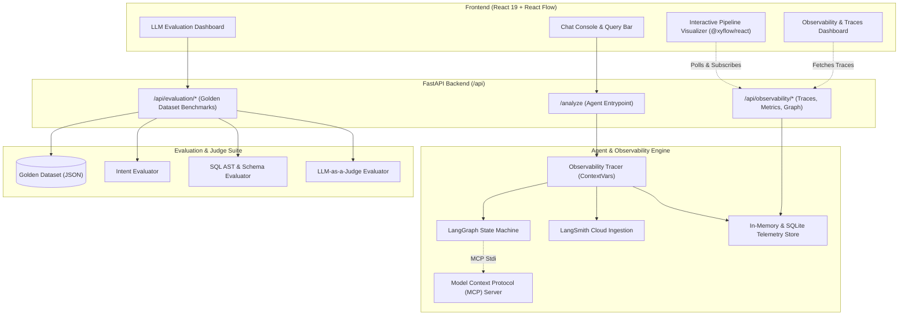
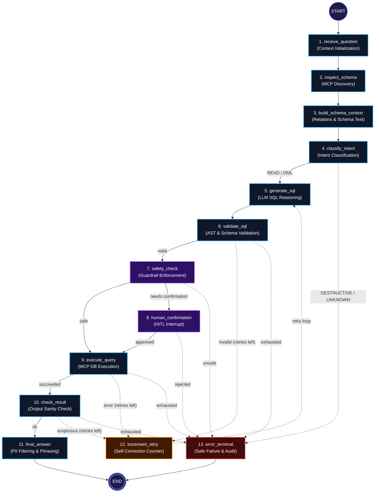
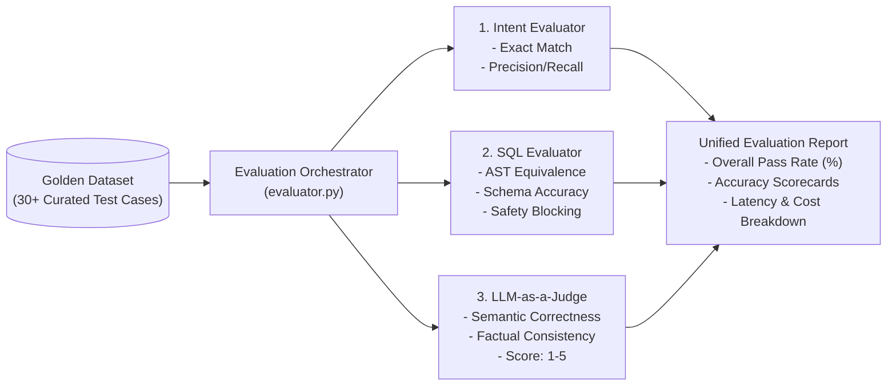

#  observability & Evaluation Architecture — AI Analyst Agent

A comprehensive guide to the **Observability, Distributed Tracing, Guardrails Auditing, Pipeline Visualization, and Automated Evaluation** subsystem in the AI Analyst Agent.

---

## 1. System Architecture & Telemetry Pipeline



---

## 2. Interactive LangGraph Visualizer Architecture

The interactive visualization graph renders the compiled LangGraph state machine, tracking executed spans in real time with dynamic edge coloring.



### Visual Edge Traversal Rules

| Edge State | Visual Style | Color Code | Description |
| :--- | :--- | :--- | :--- |
| **Active Executing** | Thick Solid + Pulse Animation | `#8b5cf6` (Purple) | The node and edge currently processing live |
| **Completed Path** | Solid Line | `#10b981` (Emerald Green) | Successfully traversed happy path |
| **HITL Awaiting Approval** | Solid Line | `#f59e0b` (Amber) | Graph paused at `human_confirmation` |
| **Executed Error / Block** | Dashed Line (`4,4`) | `#ef4444` (Bright Red) | The specific error or rejection path that was triggered |
| **Executed Retry Loop** | Dashed Line (`4,4`) | `#f59e0b` (Amber) | Self-correction loop triggered after a recoverable fault |
| **Inactive / Fallback** | Subdued Dashed Line | `#4b5563` (Muted Gray) | All alternative fallback and retry channels that did not run |

---

## 3. Core Features Breakdown

### 🔍 1. Real-Time Distributed Tracing (`app/observability/tracer.py`)
* **Hierarchical Spans:** Granular timing and context capture for all LangGraph nodes, LLM calls, and MCP tool invocations.
* **Context-Preserving Engine:** Employs Python `contextvars` to propagate trace context across asynchronous coroutines.
* **LangSmith Cloud Sync:** Automatic creation and synchronization of runs directly with the LangSmith cloud platform, including deep-link generation (`https://smith.langchain.com/...`).
* **In-Memory & Persistent Storage:** Fast retrieval of traces with chronological ordering, thread filtering, and execution metadata.

### 💰 2. Token & Financial Cost Intelligence (`app/observability/pricing.py`)
* **Exact Token Counting:** Tracks prompt tokens and completion tokens for every model invocation.
* **Dynamic Cost Calculator:** Computes dollar cost per request in real-time based on configurable model pricing:
  * Gemini 1.5/2.0 Flash & Lite
  * OpenAI GPT-4o / GPT-4o-mini
  * Anthropic Claude 3.5 Sonnet

### 🛡️ 3. Guardrails & Security Telemetry (`app/security/guardrails.py`)
* **AST Validation Logging:** SQL parsing via `sqlglot` capturing referenced tables, columns, and statement classifications.
* **HITL Interrupt Auditing:** Full tracking of human intervention events, confirmation prompts, user decisions (Approved/Rejected), and resume execution times.
* **Destructive Command Defense:** Intercepts and logs administrative SQL (`DROP`, `TRUNCATE`, `ALTER`) with unconditional rejection records in `agent_audit_log`.

### 🖥️ 4. Interactive Visual Telemetry UI (`frontend/src/components/`)
* **React Flow Canvas (`@xyflow/react`):** Interactive canvas with zoom, pan, minimap, and auto-layout.
* **Node Telemetry Drawer:** Click on any node to view:
  * Execution duration in milliseconds
  * Exact LLM system prompts and user inputs
  * Raw LLM responses and generated SQL
  * MCP server parameters and database row previews
* **Trace Timeline & Status Badges:** Color-coded status pills (`COMPLETED`, `RUNNING`, `WAITING`, `BLOCKED`, `RETRIED`, `FAILED`).

### 🧪 5. Tri-Factor Automated Evaluation Suite (`app/evaluation/`)



---

## 4. Observability & Evaluation API Reference

### Traces & Telemetry Endpoints
| Method | Endpoint | Description |
| :--- | :--- | :--- |
| `GET` | `/api/observability/traces` | Returns recent execution traces with status, latency, and cost summaries |
| `GET` | `/api/observability/traces/{trace_id}` | Detailed trace containing all individual spans, LLM calls, and MCP events |
| `GET` | `/api/observability/graph-definition` | Exports dynamic compiled LangGraph nodes, edges, and visual styling metadata |
| `GET` | `/api/observability/metrics` | Returns aggregate metrics: total requests, success rate, p50/p95 latency, total cost |
| `GET` | `/api/observability/schema-drift` | Returns schema hash changes and detected schema alterations across runs |

### Evaluation Endpoints
| Method | Endpoint | Description |
| :--- | :--- | :--- |
| `GET` | `/api/evaluation/dataset` | Returns all golden benchmark test cases |
| `POST` | `/api/evaluation/run` | Triggers a full evaluation run across the golden dataset benchmark |
| `GET` | `/api/evaluation/results` | Returns past evaluation runs with scorecard metrics |

---

## 5. Configuration & Environment Variables

Add the following to your `.env` file to enable all telemetry and evaluation features:

```env
# --- LangSmith Cloud Tracing ---
LANGSMITH_TRACING=true
LANGSMITH_API_KEY=your_langsmith_api_key_here
LANGSMITH_PROJECT=ai-analyst-agent
LANGSMITH_ENDPOINT=https://api.smith.langchain.com

# --- Model & Pricing Settings ---
LLM_API_KEY=your_gemini_or_openai_api_key
LLM_MODEL=gemini-3.5-flash-lite
LLM_BASE_URL=https://generativelanguage.googleapis.com/v1beta/openai/

# --- Guardrail & Safety Thresholds ---
REQUIRE_WRITE_CONFIRMATION=true
CONFIRMATION_ROW_THRESHOLD=1
SENSITIVE_COLUMNS=email,phone,password,ssn,aadhaar,credit_card,salary
```

---

## 6. How to Run & Inspect

1. **Start the Backend:**
   ```bash
   uvicorn app.main:app --reload
   ```
2. **Start the Frontend:**
   ```bash
   cd frontend
   npm run dev
   ```
3. **Open the Dashboard:**
   Navigate to `http://localhost:5173/` and explore:
   * **Chat Console & Live Graph:** Ask any question and watch the visualizer trace the active pipeline path.
   * **Observability Tab:** Inspect real-time spans, latency graphs, and token cost metrics.
   * **Evaluation Tab:** Run automated benchmarks against the golden test suite.
