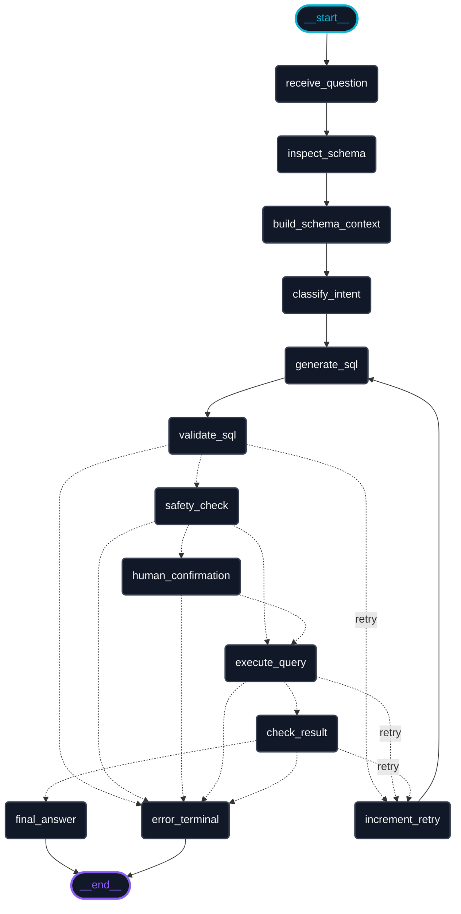

# LangGraph Workflow Visualization

This document visualizes the complete execution flow of the **AI Database Analyst Agent**. It includes a premium conceptual diagram, the exact interactive Mermaid flowchart compiled directly from the python code in [graph.py](file:///c:/Sciqus/ai-analyst/app/agent/graph.py), and descriptions of each state node.

---

## 1. Compiled Code Workflow Diagram

This is the exact PNG diagram generated by calling the built-in LangGraph visualization tool (`draw_mermaid_png()`) on the `compiled_graph` instance in [graph.py](file:///c:/Sciqus/ai-analyst/app/agent/graph.py):

## 2. Conceptual Workflow Diagram

Below is the design diagram showcasing the step-by-step logic, loopback retry paths, security check gates, and the human-in-the-loop approval step conceptually:

---

## 2. Interactive Mermaid Flowchart (Direct Code Representation)

This flowchart represents the exact edges, conditional nodes, and transitions defined in [graph.py](file:///c:/Sciqus/ai-analyst/app/agent/graph.py):

---

## 3. Workflow Steps Explained

The workflow coordinates the following nodes from [nodes.py](file:///c:/Sciqus/ai-analyst/app/agent/nodes.py):

1. **`receive_question`**: Initializes state, normalizes the user's natural language input, and resets retry counters.
2. **`inspect_schema`**: Calls the MCP tool `inspect_schema` to pull relevant database table schemas without exposing credentials to the LLM.
3. **`build_schema_context`**: Formats the schema information into a structured text representation for prompt injection.
4. **`classify_intent`**: Uses the LLM to categorize the request (e.g., Read vs. Write operation, safe vs. potentially harmful queries).
5. **`generate_sql`**: Generates raw PostgreSQL text targeting the inspected schema.
6. **`validate_sql`**: Parses the SQL string using `sqlglot` to verify syntax and ensure compile-time validity. If invalid, routes back to `increment_retry`.
7. **`safety_check`**: Checks generated SQL against guardrail rules (blocks DROP, ALTER, etc.). Evaluates write actions. If queries require approval, flags state to pause for human input.
8. **`human_confirmation`**: Acts as an **`interrupt()`** boundary. The graph execution pauses until approved or rejected via the frontend dashboard.
9. **`execute_query`**: Communicates with the MCP server to run the approved query. Errors route back to the retry node for self-correction.
10. **`check_result`**: Evaluates whether the executed query results successfully answered the user's question.
11. **`final_answer`**: Formulates a clear, user-friendly markdown response.
12. **`increment_retry`**: Updates the retry count and feeds any execution/validation errors back into the LLM context so it can self-correct.
13. **`error_terminal`**: Formulates an appropriate fallback response if retries are exhausted or security violations occur.
